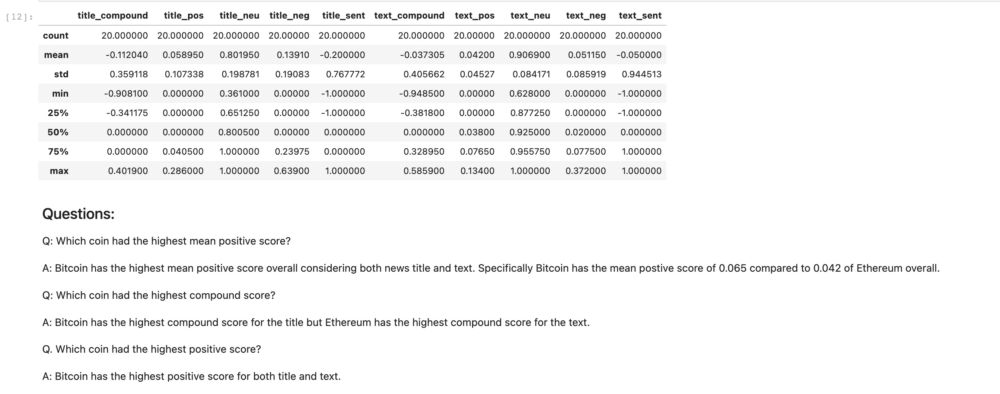
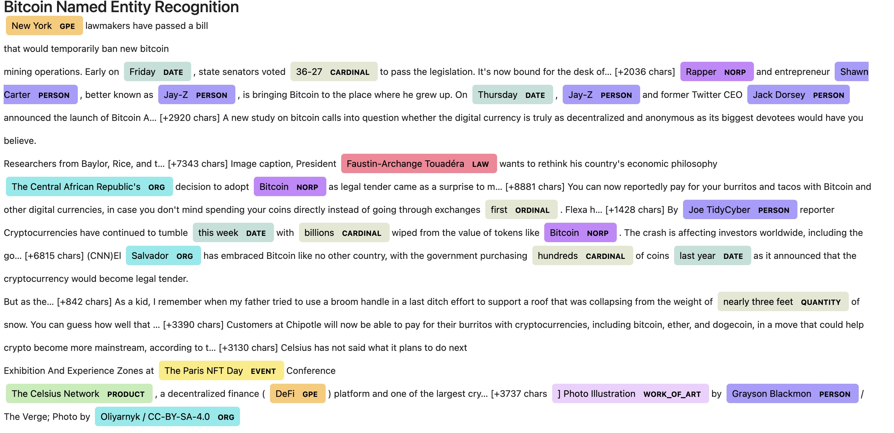

# Unit-11-Tales from Crypto Homework (Natural Language Processing Unit)

This unit uses various Natural Language Processing techniques to analyse the news articles related to Bitcoin and Ethereum and performs:

- Sentiment Analysis
- Natural Language Processing including Tokenizing and Word Clouds
- Named Entity Recognition

All of the analysis is covered in the notebook [crypto_sentiment.ipynb](crypto_sentiment.ipynb).

## Sentiment Analysis

The section of the notebook uses the [NewsAPI](https://newsapi.org/) to fetch the latest news related to two coins viz. Bitcoin and Ethereum.

For each of the news articles, it uses the  `VaderSentimentAnalyzer` to calculate the sentiment on the news title as well as the text.  It then aims to answer three key questions:
- Which coin had the highest mean positive score?
- Which coin had the highest compound score?
- Which coin had the highest positive score?

The analysis is reflected as below:

## Natural Language Processing including Tokenizing and Word Clouds

This section of the notebook then takes the each of the news article retreived from above section and:

- Cleans the text using `regex` to remove any punctuations.
- Tokenises the text using `word_tokenize`
- Removes the stop words from the tokens using the `NLTK` Stop Words Corpus.
- Lemmatize the token words into the root words using the `WordNetLemmatizer`

This creates a complete list of clean tokens which are then analysed to calculate:
- Top 10 Bigrams for Bitcoin tokens
- Top 10 Bigrams for Ethereum tokens
- Top 10 words for Bitcoin tokens
- Top 10 words for Ethereum tokens

Using all the tokens, a Word Cloud for each of Bitcoin and Ethereum is generated using `WordCloud` library as depicted below.
### Bitcoin Word Cloud

### Ethereum Word Cloud

## Named Entity Recognition
The third section of the notebook performs the entity recognition across all the Bitcoin and Ethereum news texts using the `spacy` library.

It renders the named entities visually as seen below as well as lists out entities identified across all the texts.

